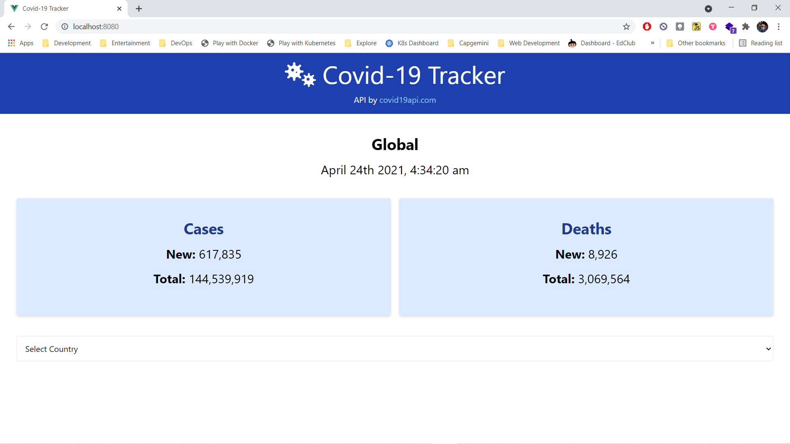
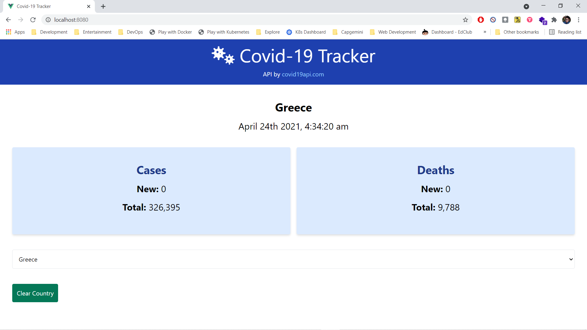

# Covid Tracker

- [Covid Tracker](#covid-tracker)
  - [Deployment](#deployment)
  - [Description](#description)
  - [Screenshots](#screenshots)

## Deployment

- Checkout deployment at <https://gagandeep39.github.io/vue-covid-tracker/>

## Description

- Covid Tracker App created using VueJS
- Uses Third Party API to fetch COVID data
- Created app using `npx @vue/cli create .`
- Install tailwind using `npx @vue/cli add tailwind  `

## Screenshots

